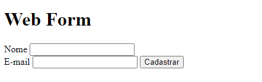
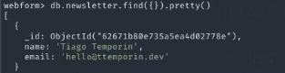

# Formulário Web usando GO e MongoDB

Este projeto consiste em um formulário web simples desenvolvido em Go. Os usuários podem preencher informações como nome e e-mail, enviando esses dados para processamento. O formulário é exibido em uma página web básica e amigável. O objetivo é demonstrar como criar um servidor web básico em Go e processar dados de formulários HTML.


## Rodando localmente

Clone o projeto

```bash
  git clone https://github.com/Ghenoo/form-web
```

Entre no diretório do projeto

```bash
  cd form-web
```

Instale o go.mongo na hora da conexão

```bash
  go mod tidy
```

Inicie o servidor

```bash
  go run main.go
```


## Instale GO em sua máquina e veja sua documentação.

 - [GO](https://go.dev/doc/install)
 - [Documentação](https://go.dev/doc/)


## Stack utilizada

**Front-end:** HTML

**Back-end:** Go, Mongo



